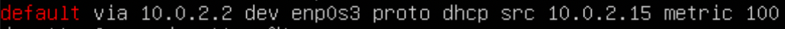
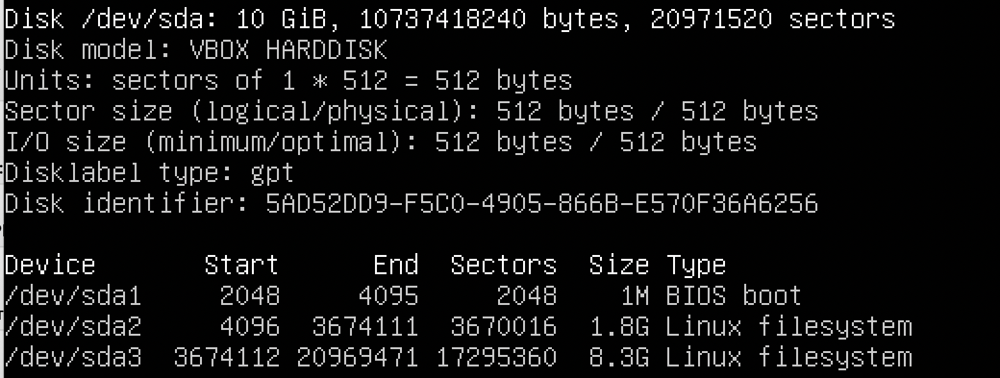
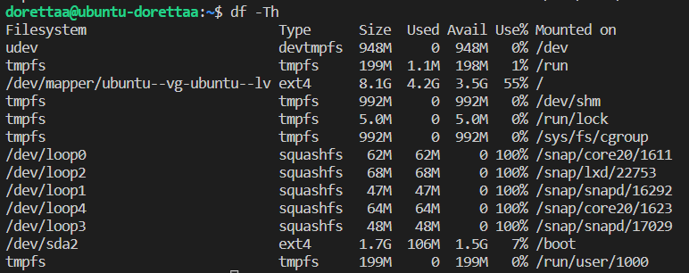
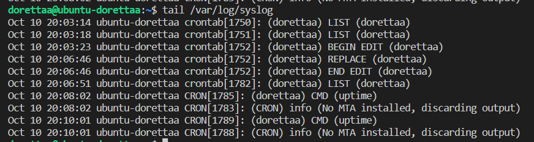

# Операционные системы UNIX/Linux (Базовый).

Установка и обновления системы Linux. Основы администрирования.

## Contents

  3.1 [Установка ОС](#part-1-установка-ос)  
  3.2 [Создание пользователя](#part-2-создание-пользователя)  
  3.3 [Настройка сети ОС](#part-3-настройка-сети-ос)   
  3.4 [Обновление ОС](#part-4-обновление-ос)  
  3.5 [Использование команды  sudo](#part-5-использование-команды-sudo)  
  3.6 [Установка и настройка службы времени](#part-6-установка-и-настройка-службы-времени)  
  3.7 [Установка и использование текстовых редакторов](#part-7-установка-и-использование-текстовых-редакторов)  
  3.8 [Установка и базовая настройка сервиса SSHD](#part-8-установка-и-базовая-настройка-сервиса-sshd)   
  3.9 [Установка и использование утилит top, htop](#part-9-установка-и-использование-утилит-top-htop)   
  3.10 [Использование утилиты fdisk](#part-10-использование-утилиты-fdisk)   
  3.11 [Использование утилиты df](#part-11-использование-утилиты-df)    
  3.12 [Использование утилиты du](#part-12-использование-утилиты-du)    
  3.13 [Установка и использование утилиты ncdu](#part-13-установка-и-использование-утилиты-ncdu)    
  3.14 [Работа с системными журналами](#part-14-работа-с-системными-журналами)     
  3.15 [Использование планировщика заданий CRON](#part-15-использование-планировщика-заданий-cron)    

## Part 1. Установка ОС
**== Задание ==**

##### Установить **Ubuntu 20.04 Server LTS** без графического интерфейса. (Используем программу для виртуализации - VirtualBox)

- Графический интерфейс должен отсутствовать.

- Узнайте версию Ubuntu, выполнив команду \
`cat /etc/issue.`
- Вставьте скриншот с выводом команды.

**== Ответ ==**

- Система установлена

## Part 2. Создание пользователя

**== Задание ==**

##### Создать пользователя, отличного от пользователя, который создавался при установке. Пользователь должен быть добавлен в группу `adm`.

- Вставьте скриншот вызова команды для создания пользователя.
- Новый пользователь должен быть в выводе команды \
`cat /etc/passwd`
- Вставьте скриншот с выводом команды.

**== Ответ ==**

- Создание пользователя 

`sudo useradd admin -G adm -p 123` (`sudo adduser --ingroup adm`)

- `cat /etc/passwd`

## Part 3. Настройка сети ОС

**== Задание ==**

##### Задать название машины вида user-1  
##### Установить временную зону, соответствующую вашему текущему местоположению.  
##### Вывести названия сетевых интерфейсов с помощью консольной команды.
- В отчёте дать объяснение наличию интерфейса lo.  
##### Используя консольную команду получить ip адрес устройства, на котором вы работаете, от DHCP сервера. 
- В отчёте дать расшифровку DHCP.  
##### Определить и вывести на экран внешний ip-адрес шлюза (ip) и внутренний IP-адрес шлюза, он же ip-адрес по умолчанию (gw). 
##### Задать статичные (заданные вручную, а не полученные от DHCP сервера) настройки ip, gw, dns (использовать публичный DNS серверы, например 1.1.1.1 или 8.8.8.8).  
##### Перезагрузить виртуальную машину. Убедиться, что статичные сетевые настройки (ip, gw, dns) соответствуют заданным в предыдущем пункте.  

- В отчёте опишите, что сделали для выполнения всех семи пунктов (можно как текстом, так и скриншотами).
- Успешно пропинговать удаленные хосты 1.1.1.1 и ya.ru и вставить в отчёт скрин с выводом команды. В выводе команды должна быть фраза "0% packet loss".

**== Ответ ==**

1) Изменение имени машины

  - `sudo hostnamectl set-hostname user-dorettaa`
  - Изменение имени машины
  
  

2) Установка временной зоны

  - `sudo timedatectl set-timezone Europe/Moscow`
  - Временная зона изменена
  

3) Вывод названия сетевых интерфейсов

  - `ip -br link show` (`ifconfig` - шире)
  - Список сетевых интерфейсов

  
  enp - сетевой интерфейс проводного интернета
  lo - локальный интерфейс, присутствующий в каждом линукс позволяющий программам обращаться к компьютеру

4) Получение ip устройства от DHCP (Dynamic Host Configuration Protocol). DHCP служит для назначения ip клиенту.

  - `sudo dhclient -v`
  - 

5) Внешний и внутренний ip адрес шлюза

  - Внешний ip шлюза 
  
  `wget eth0.me -qO -` (`curl ifconfig.me/ip`)
  

  - Внутренний ip шлюза
  
  `ip route | grep default` (`hostname -I`)

6) Статичные ip, gw, dns

  - Файл с сетевыми настройками до редактирования
  

  - После редактирования
  

    `sudo netplan apply`
    
    `sudo reboot now`

7) Проверка статичных настроек после перезагрузки
  - После перезагрузки
  

  - `ping 1.1.1.1`
  

  - `ping ya.ru`
  

  
## Part 4. Обновление ОС

**== Задание ==**

##### Обновить системные пакеты до последней на момент выполнения задания версии.  

- После обновления системных пакетов, если ввести команду обновления повторно, должно появится сообщение, что обновления отсутствуют.
- Вставить скриншот с этим сообщением в отчёт.

**== Ответ ==**
  - `sudo apt update`
  - `sudo apt upgrade`
  

## Part 5. Использование команды **sudo**

**== Задание ==**

##### Разрешить пользователю, созданному в [Part 2](#part-2-создание-пользователя), выполнять команду sudo.

- В отчёте объяснить *истинное* назначение команды sudo (про то, что это слово - "волшебное", писать не стоит).  
- Поменять hostname ОС от имени пользователя, созданного в пункте [Part 2](#part-2-создание-пользователя) (используя sudo).
- Вставить скрин с изменённым hostname в отчёт.

**== Ответ ==**

   - sudo (англ. Substitute User and do, дословно «подменить пользователя и выполнить») - По умолчанию sudo запускает переданную ей команду от имени суперпользователя. sudo позволяет выполнить одну или несколько команд от имени текущего пользователя, которому система временно повышает привилегии, а после выполнения команды — снова снижает их.

  - `sudo usermod -aG sudo admin`

   - `su - admin`

## Part 6. Установка и настройка службы времени

**== Задание ==**

##### Настроить службу автоматической синхронизации времени.  

- Вывести время, часового пояса, в котором вы сейчас находитесь.
- Вывод следующей команды должен содержать `NTPSynchronized=yes`: \
  `timedatectl show`
- Вставить скрины с корректным временем и выводом команды в отчёт.

**== Ответ ==**

  - `sudo systemctl stop systemd-timesyncd`
  - `sudo systemctl disable systemd-timesyncd`
  - `sudo apt install ntp`
  - `sudo systemctl enable --now ntp`
 
  

## Part 7. Установка и использование текстовых редакторов 

**== Задание ==**

##### Установить текстовые редакторы **VIM** (+ любые два по желанию **NANO**, **MCEDIT**, **JOE** и т.д.)  
##### Используя каждый из трех выбранных редакторов, создайте файл *test_X.txt*, где X -- название редактора, в котором создан файл. Напишите в нём свой никнейм, закройте файл с сохранением изменений.  
- В отчёт вставьте скриншоты:
  - Из каждого редактора с содержимым файла перед закрытием.
- В отчёте укажите, что сделали для выхода с сохранением изменений.
##### Используя каждый из трех выбранных редакторов, откройте файл на редактирование, отредактируйте файл, заменив никнейм на строку "21 School 21", закройте файл без сохранения изменений.
- В отчёт вставьте скриншоты:
    - Из каждого редактора с содержимым файла после редактирования.
- В отчёте укажите, что сделали для выхода без сохранения изменений.
##### Используя каждый из трех выбранных редакторов, отредактируйте файл ещё раз (по аналогии с предыдущим пунктом), а затем освойте функции поиска по содержимому файла (слово) и замены слова на любое другое.
- В отчёт вставьте скриншоты:
    - Из каждого редактора с результатами поиска слова.
    - Из каждого редактора с командами, введёнными для замены слова на другое.

**== Ответ ==**

  1) Создание файла с никнеймом

- Скриншот перед закрытием файла test_vim.txt:  
      
  Для закрытия файла с сохранением изменений в vim используется ":wq".
- Скриншот перед закрытием файла test_nano.txt:  
      
  Для закрытия файла с сохранением изменений в редакторе nano использованы сочетания Ctrl + O - для сохранения, Ctrl + X - для закрытия редактора.
- Скриншот перед закрытием файла test_mcedit.txt:  
      
  Для закрытия файла с сохранением изменений в редакторе mcedit использованы F2 - для сохранения, F10 - для закрытия редактора.
 
 2) Выход без сохранения
  - Скриншот перед закрытием файла test_vim.txt:  
    
  - Скриншот после редактирования test_vim.txt:  
      
  Для закрытия файла без сохранения изменений использована команда в редакторе vim ":q!"
  - Скриншот перед закрытием файла test_nano.txt:  
    
  - Скриншот после редактирования test_nano.txt:  
        
  Для закрытия файла без сохранения изменений в редакторе nano использовано сочетание Ctrl + X.
  - Скриншот перед закрытием файла test_mcedit.txt:  
    
  - Скриншот после редактирования test_mcedit.txt:  
      
  Для закрытия файла без сохранения изменений в редакторе mcedit использовано F10.
  
3) Поиск и замена слова. Во всех трех файлай никнейм предварительно заменен 21 School 21
- Скриншот из редактора vim с результатами поиска слова "21":  
  
  Для поиска слова использовано "/21".
- Скриншот из редактора vim с командой для замены слова "21" на  слово "42":  
  
  Для замены слова использовано ":s/21/42".

- Скриншот из редактора nano с результатами поиска слова "21":  
    
  Для поиска слова используется сочетание Ctrl + W
- Скриншот из редактора nano с командой для замены слова "21" на  слово "42":  
    
  Для замены слова использована команда Ctrl + \

- Скриншот из редактора  с mcedit результатами поиска слова "21":  
   
  Для поиска слова использована F7.
- Скриншот из редактора mcedit с командой для замены слова "21" на  слово "42":  
    
  Для замены слова использована F4.

## Part 8. Установка и базовая настройка сервиса **SSHD**

**== Задание ==**

##### Установить службу SSHd.  
##### Добавить автостарт службы при загрузке системы.  
##### Перенастроить службу SSHd на порт 2022.  
##### Используя команду ps, показать наличие процесса sshd. Для этого к команде нужно подобрать ключи.
- В отчёте объяснить значение команды и каждого ключа в ней.
##### Перезагрузить систему.
- В отчёте опишите, что сделали для выполнения всех пяти пунктов (можно как текстом, так и скриншотами).
- Вывод команды netstat -tan должен содержать  \
`tcp 0 0 0.0.0.0:2022 0.0.0.0:* LISTEN`  \
(если команды netstat нет, то ее нужно установить)
- Скрин с выводом команды вставить в отчёт.
- В отчёте объяснить значение ключей -tan, значение каждого столбца вывода, значение 0.0.0.0.

**== Ответ ==**

1) `sudo apt install openssh-server` (Установка службы SSHd)

2) `sudo systemctl enable ssh` (Автостарт при загрузке системы)
- служба SSHd работает

3) `sudo vim /etc/ssh/sshd_config` (Изменение порта ssh)
- `sudo ufw allow 2022/tcp`
- `sudo service ssh restart`

4) ` ps -auxf | grep ssh` (Вывод процесса ssh)

- команда ps отображает список текущих процессов

  -a - выбрать все процессы кроме фоновых;

  -u - выбрать процессы пользователя; 

  -f - вывести максимум доступных данных; 

  -x - отображение процессов, отсоединенных от терминала.
5) `sudo reboot now`
- `netstat -tan`

- netstat(network status) Отображает активные TCP-соединения, порты, которые прослушивает компьютер, статистику Ethernet, таблицу IP-маршрутизации.
Ключи tan: 

  -t - отображает статус подключения протокола передачи TCP;

  -a - Отображает все активные соединения TCP и порты TCP и UDP, которые прослушивает компьютер.; 

  -n - Отображает активные TCP-соединения, однако адреса и номера портов выражаются в числовом виде, и попытки определить имена не предпринимаются.
- Значение столбцов вывода: 
    - Proto - название протокола; 
    - Recv-Q - очередь получения сети; 
    - Send-Q - сетевая очередь отправки; 
    - Local Address - локальный IP-адрес, участвующий в соединении или связанный со службой, участвующей в соединении.; 
    - Foreign Address - внешний IP-адрес, учавствующий в создании соединения; 
    - State - состояние соединение;
- Значение 0.0.0.0 - означает, что в соединении могут использоваться все IP-адреса на локальном компьютере.

## Part 9. Установка и использование утилит **top**, **htop**

**== Задание ==**

##### Установить и запустить утилиты top и htop.  

- По выводу команды top определить и написать в отчёте:
  - uptime
  - количество авторизованных пользователей
  - общую загрузку системы
  - общее количество процессов
  - загрузку cpu
  - загрузку памяти
  - pid процесса занимающего больше всего памяти
  - pid процесса, занимающего больше всего процессорного времени
- В отчёт вставить скрин с выводом команды htop:
  - отсортированному по PID, PERCENT_CPU, PERCENT_MEM, TIME
  - отфильтрованному для процесса sshd
  - с процессом syslog, найденным, используя поиск 
  - с добавленным выводом hostname, clock и uptime  

**== Ответ ==**

- Вывод команды top:

- Сортировка по памяти shift + M

  - uptime: 8 min
  - количество авторизованных пользователей: 1
  - общую загрузку системы: 0
  - общее количество процессов: 95
  - загрузку cpu: 0%/0.3%
  - загрузку памяти: 23.8%
  - pid процесса занимающего больше всего памяти:  652
  - pid процесса, занимающего больше всего процессорного времени: 1014

- Вывод команды htop:
Сортировка F6, фильтр F4, поиск F3
  - отсортированный по PID
  
  - отсортированный по PERCENT_CPU
  
  - отсортированный по PERCENT_MEM
  
  - отсортированный по TIME
  
  - отфильтрованному для процесса sshd
  
  - с процессом syslog, найденным, используя поиск 
  
  - с добавленным выводом hostname, clock и uptime 
  

## Part 10. Использование утилиты **fdisk**

**== Задание ==**

##### Запустить команду fdisk -l.

- В отчёте написать название жесткого диска, его размер и количество секторов, а также размер swap.

**== Ответ ==**

- `fdisk -l`

   - название жесткого диска /dev/sda 
   - размер 10 GiB
   - количество секторов 20971520
   - размер swap  1.5 GB

## Part 11. Использование утилиты **df** 

**== Задание ==**

##### Запустить команду df.  
- В отчёте написать для корневого раздела (/):
  - размер раздела
  - размер занятого пространства
  - размер свободного пространства
  - процент использования
- Определить и написать в отчёт единицу измерения в выводе.  

##### Запустить команду df -Th.
- В отчёте написать для корневого раздела (/):
    - размер раздела
    - размер занятого пространства
    - размер свободного пространства
    - процент использования
- Определить и написать в отчёт тип файловой системы для раздела.

**== Ответ ==**
 - Запущена команда df. 
 
- Для корневого раздела (/):
  - размер раздела: 8408452
  - размер занятого пространства: 4353136
  - размер свободного пространства: 3606600
  - процент использования: 55%
- Единица измерения: Килобайт

 - Запущена команда df -Th. (Человекочитаемый вывод, указать типы файловых систем)
 
- Для корневого раздела (/):
    - размер раздела: 8,1 ГБ
    - размер занятого пространства: 4,2 ГБ
    - размер свободного пространства: 3,5 ГБ
    - процент использования: 55%
- Тип файловой системы для раздела: ext4

## Part 12. Использование утилиты **du**

**== Задание ==**

##### Запустить команду du.
##### Вывести размер папок /home, /var, /var/log (в байтах, в человекочитаемом виде)
##### Вывести размер всего содержимого в /var/log (не общее, а каждого вложенного элемента, используя *)

- В отчёт вставить скрины с выводом всех использованных команд.

**== Ответ ==**

 - Запущена команда du.

 
 - размер папок:
    - /home
    
    
    
    - /var

    
    
    - /var/log 

     
     
 - Размер всего содержимого в /var/log 
  
  

## Part 13. Установка и использование утилиты **ncdu**

**== Задание ==**

##### Установить утилиту ncdu.
##### Вывести размер папок /home, /var, /var/log.

- Размеры должны примерно совпадать с полученными в [Part 12](#part-12-использование-утилиты-du).

- В отчёт вставить скрины с выводом использованных команд.

**== Ответ ==**

 - размер папок: ncdu i "folder"
    - /home
    
    

    - /var

    

    - /var/log 

     

## Part 14. Работа с системными журналами

**== Задание ==**

##### Открыть для просмотра:
##### 1. /var/log/dmesg
##### 2. /var/log/syslog
##### 3. /var/log/auth.log  

- Написать в отчёте время последней успешной авторизации, имя пользователя и метод входа в систему.
- Перезапустить службу SSHd.
- Вставить в отчёт скрин с сообщением о рестарте службы (искать в логах).

**== Ответ ==**

1. /var/log/dmesg

   

2. /var/log/syslog

    

3. /var/log/auth.log

   

- Время последней успешной авторизации 10 Октября 16:30:44
  - Имя пользователя dorettaa
  - Метод входа в систему systemd-logind
- Перезапустить службу SSHd.
- Cкрин с сообщением о рестарте службы
 

## Part 15. Использование планировщика заданий **CRON**

**== Задание ==**

##### Используя планировщик заданий, запустите команду uptime через каждые 2 минуты.
- Найти в системных журналах строчки (минимум две в заданном временном диапазоне) о выполнении.
- Вывести на экран список текущих заданий для CRON.
- Вставить в отчёт скрины со строчками о выполнении и списком текущих задач.

##### Удалите все задания из планировщика заданий.
- В отчёт вставьте скрин со списком текущих заданий для CRON.

**== Ответ ==**

1. Используя планировщик заданий, запустить команду uptime через каждые 2 минуты.

`crontab -e`
- Найти в системных журналах строчки (минимум две в заданном временном диапазоне) о выполнении.

- Вывести на экран список текущих заданий для CRON.

2. Удалить все задания из планировщика заданий.
- Скрин со списком текущих заданий для CRON.

